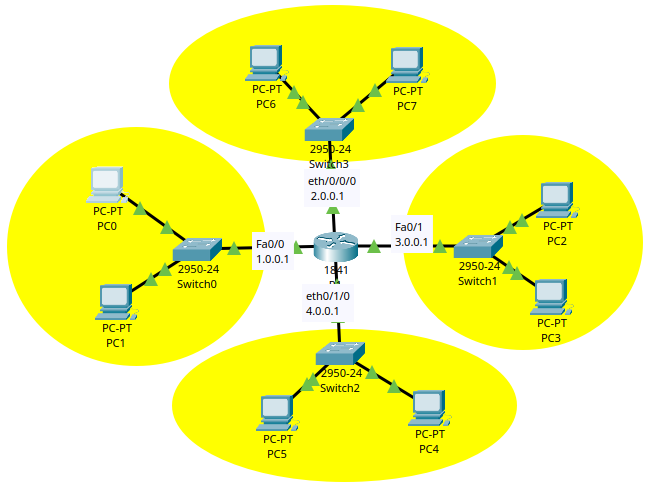

# DHCP Network Lab

## Objective

Simulate a corporate network using a router configured as a DHCP server to automatically distribute IP addresses across multiple networks.

---

## Topology




- 1 Router
- 4 Switches
- 8 PCs
- 4 Networks

---

## Concepts Practiced

- DHCP
- Subnetting
- Gateway configuration
- Automatic IP addressing
- Network segmentation
- Troubleshooting

---

## Network Design

| Network | Gateway |
|---|---|
| 1.0.0.0 | 1.0.0.1 |
| 2.0.0.0 | 2.0.0.1 |
| 3.0.0.0 | 3.0.0.1 |
| 4.0.0.0 | 4.0.0.1 |

---

## DHCP Configuration Example

```bash
ip dhcp pool LAN1
network 1.0.0.0 255.0.0.0
default-router 1.0.0.1
```

---

## Troubleshooting

### Issue
PCs were not receiving IP addresses.

### Cause
Incorrect gateway configuration.

### Solution
Adjusted DHCP pool and router interfaces.

---

## Tools Used

- Cisco Packet Tracer
